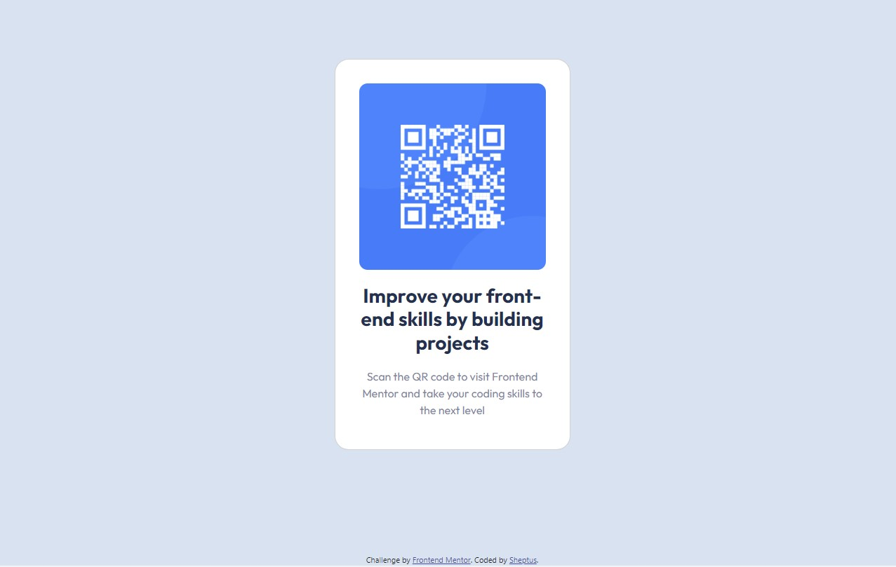

# Frontend Mentor - QR code component solution

This is a solution to the [QR code component challenge on Frontend Mentor](https://www.frontendmentor.io/challenges/qr-code-component-iux_sIO_H). Frontend Mentor challenges help you improve your coding skills by building realistic projects. 

## Table of contents

- [Frontend Mentor - QR code component solution](#frontend-mentor---qr-code-component-solution)
  - [Table of contents](#table-of-contents)
  - [Overview](#overview)
    - [Screenshot](#screenshot)
      - [Mobile Screenshot](#mobile-screenshot)
      - [Desktop Screenshot](#desktop-screenshot)
    - [Links](#links)
  - [My process](#my-process)
    - [Built with](#built-with)
  - [Author](#author)

## Overview
First challenge from Frontend Mentor - responsive QR Code component
in this challenge practice with HTML and CSS to design the QR code component adjustebale for 2 screens sizes 
for a mobile and desktop devices.   
### Screenshot

#### Mobile Screenshot

#### Desktop Screenshot

### Links

- Solution URL: [Solution URL:](https://github.com/Sheptus/QR-code-component)
- Live Site URL: [Live Site URL:](https://sheptus.github.io/csb-9u9vip/)

## My process

### Built with

- Semantic HTML5 markup
- CSS custom properties
- Flexbox
- CSS Grid
- Mobile-first workflow
- Bootstrap 5

## Author

- Frontend Mentor - [@Sheptus](https://www.frontendmentor.io/profile/Sheptus)
